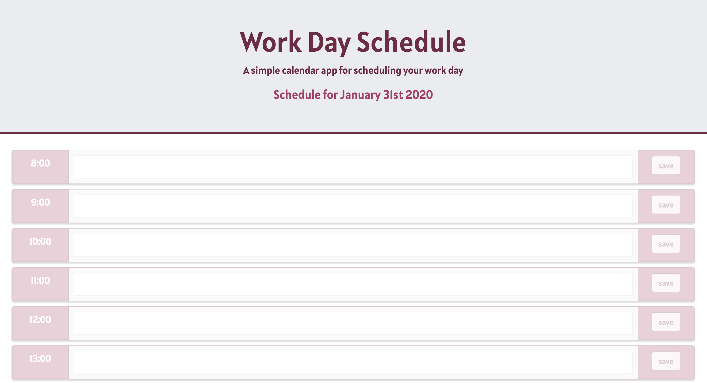

# DayPlanner

Day Planner Application

This is a calendar application that allows you to save events for each hour of the day. The app runs in the browser and features dynamically updated HTML and CSS powered by jQuery.

It displays standard business hours (8:00am to 6:00pm) and each time slot represents one hour and contains the following:

The time

A field to hold user input

A save button

Clicking on the save button will store the time and user input in localStorage.

Near the top of the calendar, the application dispalys the current day. Each hour is color coded / opacity differnces to reflect whether the time slot is in the past, the present, or the future. This will change depending on the time of day.

The Moment.js library was used to work with date and time.

<a href="https://steffield.github.io/DayPlanner/">Day Planner Application</a>
